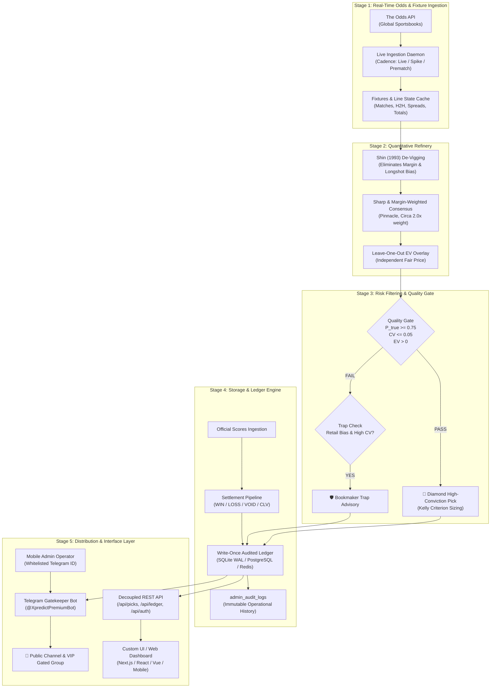

# LISA — Quantitative Sports Prediction Refinery & Autonomous Engine

> **Enterprise-grade algorithmic sports forecasting, consensus de-vigging, and execution routing with an autonomous Telegram Gatekeeper and Mobile Admin Console.**

[](https://www.python.org/downloads/)
[]()
[]()
[]()

---

## 1. Executive Summary

**LISA** (*Live Ingestion, Statistical Arbitrage & Algorithmic Refinery*) is an institutional-grade sports prediction backend. Rather than relying on black-box heuristics or subjective handicapping, LISA functions as a **mathematical data refinery**:

1. **Multi-Book Ingestion**: Ingests real-time odds across global bookmakers (Pinnacle, Bet365, DraftKings, BetMGM, etc.).
2. **Consensus De-Vigging**: Eliminates synthetic bookmaker margins and favourite–longshot bias using **Shin's Method** ($z$-parameter solving) combined with sharp/margin-weighted aggregation.
3. **Leave-One-Out Expected Value (EV)**: Measures each sportsbook's price against an independent consensus excluding itself to identify genuine market mispricings.
4. **Algorithmic Quality Gate**: Emits only high-conviction selections clearing certainty ($\ge 75\%$), strict cross-bookmaker agreement, and positive EV thresholds.
5. **Trap Detection Engine**: Automatically flags and warns against deceptive public favorites driven by retail inflation.
6. **Multi-Platform Execution Slips**: Converts selections into direct 1-click booking codes across major sportsbooks (SportyBet, Football.com, 1xBet, Bet9ja, Betway, Bet365).
7. **Write-Once Audited Ledger**: Immutable settlement pipeline grading results against official score feeds, tracking Closing Line Value (CLV) and Brier calibration.
8. **Decoupled Architecture**: 100% headless backend exposing robust REST API contracts for custom UI/UX applications, paired with an asynchronous Telegram Gatekeeper Bot and Mobile Admin Console.

---

## 2. System Architecture



---

## 3. UI Designer & Frontend Integration Guide

> [!IMPORTANT]
> **To UI/UX Designers and Frontend Engineers:**
> The LISA engine is designed to be **completely headless and UI-agnostic**. You have 100% freedom to create modern web dashboards, mobile applications, or portal interfaces using your preferred tech stack (e.g. Next.js, React, Tailwind CSS, Svelte, Vue, or Flutter). The backend provides clean REST API endpoints returning predictable, structured JSON contracts.

### Key Frontend Data Endpoints

The LISA server runs by default on `http://localhost:8080` and provides the following core endpoints:

| Endpoint | Method | Purpose | Response Format |
| :--- | :---: | :--- | :--- |
| `/api/health` | `GET` | System health, database driver, active fixtures count, bot status | JSON (`status`, `ledger_counts`, `telegram_bot`, `odds_feed`) |
| `/api/picks` or `/data/dashboard.json` | `GET` | Active refined picks, fair odds, execution recommendations, booking codes | JSON Array of Pick Objects |
| `/api/ledger` | `GET` | Audited historical settlement ledger, win rates, net units, CLV, Brier calibration | JSON (`summary`, `picks_settled`, `monthly_breakdown`) |
| `/data/live_booking_codes.json` | `GET` | Configurable platform-specific booking codes for accumulator / straight slips | JSON Object (`sportybet`, `football_com`, `1xbet`, etc.) |
| `/api/verify-status?user_id={id}` | `GET` | Checks if a web visitor has verified their Telegram channel membership | JSON (`verified`: `bool`, `tier`: `str`) |
| `/api/auth/me` | `GET` | Current authenticated user profile, bankroll parameters, and tier level | JSON (`user_id`, `email`, `tier`, `bankroll`) |
| `/api/auth/login` | `POST` | User authentication returning session token | JSON (`token`, `user`) |
| `/api/auth/register` | `POST` | New user account creation | JSON (`token`, `user`) |

### JSON Data Contract: Refined Pick Object

When rendering active match cards, the frontend receives picks in the following schema:

```json
{
  "id": "match_epl_20260921_mci_ips",
  "match_id": "soccer_epl_mci_ips",
  "home_team": "Manchester City",
  "away_team": "Ipswich Town",
  "sport_key": "soccer_epl",
  "sport_title": "Premier League",
  "commence_time": "2026-09-21T19:00:00Z",
  "countdown_seconds": 5400,
  "human_countdown": "Starts in 1h 30m",
  "market": "h2h",
  "outcome_name": "Manchester City",
  "p_true": 0.833,
  "fair_odds": 1.20,
  "best_odds": 1.25,
  "best_bookmaker": "SportyBet",
  "ev_pct": 4.1,
  "conviction_score": 8.4,
  "recommended_stake_units": 1.5,
  "recommended_stake_cash": 75.00,
  "is_gated": false,
  "booking_codes": {
    "sportybet": "SB-892104",
    "football_com": "FC-119284",
    "1xbet": "1X-559281",
    "bet9ja": "B9-90214",
    "betway": "BW-44912",
    "bet365": "365-88210"
  },
  "deep_links": {
    "sportybet": "https://www.sportybet.com/?code=SB-892104",
    "football_com": "https://www.football.com/?code=FC-119284",
    "1xbet": "https://1xbet.com/?code=1X-559281"
  }
}
```

### UI Implementation Guidelines

1. **Dynamic Kickoff Timers**:
   - Use the `commence_time` ISO-8601 string to initialize an active client-side ticker (`setInterval` tick every 60s) rather than displaying static countdowns.
2. **Platform Bet Codes & Logos**:
   - Rather than forcing users onto external affiliate links that get blocked by ad-blockers or telecommunications providers, display **1-Click Copyable Booking Codes** with bookmaker logos (SportyBet, Football.com, 1xBet, Bet9ja, Betway, Bet365).
3. **Gated Tier Blur**:
   - Free users see Pick #1 clear. Picks #2 and #3 are blurred until unlocked via Telegram community verification (`/api/verify-status`). Picks #4+ are unlocked for Tier 2/3 subscribers.
4. **Interactive Kelly Sizing**:
   - Multiply `recommended_stake_units` by the user's active bankroll capital configured in their profile.

---

## 4. Multi-Bookmaker Booking Code System

A major failure point in commercial sports advisory platforms is user drop-off caused by broken tracking links, domain blocks, and browser extensions.

LISA solves this by providing **Native Multi-Bookmaker Booking Codes**:

* **Supported Platforms**: SportyBet, Football.com, 1xBet, Bet9ja, Betway, Bet365.
* **Instant Slip Loading**: Bettors simply copy a 6-digit booking code (e.g. `FC-902143`), paste it into their sportsbook app, and their wager slip is automatically populated with the exact selections and market prices.
* **Administrator Overrides**: Administrators can update live accumulator codes in real time via [`web/data/live_booking_codes.json`](web/data/live_booking_codes.json) or through the Telegram Bot console without restarting the server.

---

## 5. Telegram Gatekeeper Bot & Mobile Admin Console

LISA features an integrated, asynchronous Telegram engine (`engine/lisa/telegram_bot.py`) operating under `@XpredictPremiumBot`.

### User Facing Features
* **Persistent Bottom Keyboards**: Instant 1-tap navigation for `📊 Active Top Picks`, `🏦 My Bankroll`, `📈 Accuracy Ledger`, `⚡ 5-Fold Parlay`, `🎟️ Bookmaker Codes`, and `🛡️ Trap Advisories`.
* **Stateful Bankroll Onboarding (FSM)**: A conversational Finite State Machine guides users through entering their bankroll size, selecting their Kelly risk profile (Quarter, Half, Full Kelly), and choosing their primary bookmaker.
* **Community Gatekeeper**: Automatically verifies that web visitors have joined the official Telegram community channel via `getChatMember` before unlocking free picks.

### Executive Mobile Admin Console
Instead of requiring an admin web panel with security overhead, the system owner's mobile Telegram app serves as the **Executive Control Terminal**.

Whitelisted Telegram IDs (`ADMIN_TELEGRAM_IDS=8720543490`) unlock executive commands:

| Admin Command | Syntax | Operational Function |
| :--- | :--- | :--- |
| **Console Dashboard** | `/admin` or `/sys_status` | View system run-state, active picks count, ledger health, and trigger quick-action buttons (`⏸️ Pause`, `▶️ Resume`, `🔄 Refresh`, `📜 Logs`). |
| **Manual Match Settle** | `/settle <match_id> <WIN\|LOSS\|VOID>` | Atomically settles bugged, delayed, or postponed matches; recalculates net units and CLV; syncs public ledger; notifies VIP channels. |
| **Customer Provisioner** | `/grant <email> <tier1\|tier2\|tier3>` | Grants manual access (cash/crypto payments or influencer trials), updates user profile to active, and generates a self-destructing 1-use channel invite link. |
| **Global Broadcast** | `/broadcast <message>` | Securely transmits high-priority announcements across both public community and VIP channels simultaneously. |
| **Emergency Kill-Switch** | `/sys_pause` | Immediately halts all automated channel broadcasts if a data provider feed fails or provides corrupted odds. |
| **System Resume** | `/sys_resume` | Restores automated signal generation and broadcast distribution. |
| **Audit Log Trail** | `/admin_logs` | Dumps recent immutable administrative records from `admin_audit_logs`. |

---

## 6. Mathematical Core & Methodology

### 1. Shin's Method De-Vigging
Traditional de-vigging proportionally divides the overround across outcomes, preserving the favourite–longshot bias. LISA solves for Shin’s insider-trading parameter $z$ such that:

$$\sum_{i=1}^n \left( \sqrt{z^2 + 4(1-z)\frac{p_i^2}{\pi_i}} - z \right) \Big/ 2(1-z) = 1$$

This extracts the true objective win probability $P_{\text{true}}$ free of sportsbook distortion.

### 2. Leave-One-Out Expected Value
Rather than testing an odds offering against a consensus that includes that very bookmaker's price, LISA calculates consensus excluding bookmaker $b$:

$$\text{EV}_b = \left( P_{\text{true}, \setminus b} \times \text{Odds}_b \right) - 1$$

A selection is only emitted if $\text{EV}_b > 0$.

### 3. Trap Detection Engine
When a high-profile public favorite exhibits:
* Extreme retail handle concentration
* High cross-bookmaker coefficient of variation ($\text{CV} > 0.05$)
* Negative Leave-One-Out EV across sharp books (Pinnacle/Circa)

LISA suppresses the selection and emits a **Trap Advisory**, preventing users from falling into value-negative chalk traps.

---

## 7. Configuration & Environment Variables

Copy `.env.example` to `.env` and configure your credentials:

```bash
cp .env.example .env
```

```ini
# ==============================================================================
# TELEGRAM BOT & CHANNEL DISPATCH
# ==============================================================================
LISA_TELEGRAM_TOKEN=8963364557:AAGQ4_eQDCyhzVY_LY0b0LVEOep9Kh_B8e8
LISA_TELEGRAM_CHAT_ID=@lisa_sports_alpha
LISA_TIER2_TELEGRAM_CHAT_ID=-1001234567890
ADMIN_TELEGRAM_IDS=8720543490

# ==============================================================================
# DATA SOURCE: THE ODDS API
# ==============================================================================
THE_ODDS_API_KEY=your_the_odds_api_key_here
THE_ODDS_API_BASE_URL=https://api.the-odds-api.com

# ==============================================================================
# REFINERY & QUALITY GATE PARAMETERS
# ==============================================================================
LISA_GATE_THRESHOLD=0.75
LISA_MAX_CV=0.05
LISA_MIN_BOOKS_ALERT=5
LISA_STORAGE=sqlite
LISA_PORT=8080
```

---

## 8. Quickstart & Operational Commands

### 1. Launch Unified Production Stack
Runs the HTTP REST API server, live Odds API background poller, and Telegram Bot Gatekeeper daemon concurrently:

```bash
PYTHONPATH=engine python3 -m lisa.cli start --port 8080
```

### 2. Run Telegram Bot in Interactive Terminal Console
Test user interactions and administrative commands directly from your shell:

```bash
PYTHONPATH=engine python3 -m lisa.cli telegram-bot --interactive
```

### 3. Run Automated Tests
Execute the 187 unit and integration tests covering the mathematical core, FSM, admin overrides, and REST endpoints:

```bash
PYTHONPATH=engine pytest engine/tests
```

### 4. Docker Deployment
Deploy via Docker Compose with zero external dependencies:

```bash
docker compose up -d --build
```

---

## 9. Repository Layout

```
├── .env.example               # Environment variables template
├── README.md                  # Project overview & architectural guide
├── architecture/              # Original product architecture blueprints
├── docs/
│   └── DESIGN.md              # Mathematical proofs, Shin analysis, and benchmark reports
├── engine/                    # Python core package (stdlib-only runtime)
│   ├── lisa/
│   │   ├── shin.py            # Shin (1993) de-vigging & z-parameter root finder
│   │   ├── consensus.py       # Sharp/margin-weighted consensus aggregation
│   │   ├── gate.py            # 75% Certainty gate, Leave-One-Out EV, and Trap detector
│   │   ├── storage.py         # SQLite WAL, Postgres, and Redis storage drivers
│   │   ├── telegram_bot.py    # Telegram Bot, FSM bankroll onboarding & Admin console
│   │   ├── live_ingest.py     # Background odds poller & alert dispatcher
│   │   ├── server.py          # Decoupled HTTP/REST API server
│   │   ├── settle.py          # Automated match settlement & CLV calculator
│   │   └── cli.py             # Unified CLI commands (start, telegram-bot, live-ingest)
│   └── tests/                 # 187 comprehensive automated unit and integration tests
├── web/                       # Reference decoupled web terminal
│   ├── index.html             # UI structure & layout
│   ├── css/                   # Vanilla styling & responsive glassmorphic system
│   ├── js/                    # Client app, REST API bridge, countdowns & calculator
│   └── data/                  # Static fallbacks & live_booking_codes.json
└── docker-compose.yml         # Containerized production deployment
```

---

## 10. Security & Responsible Gambling

* **Anti-Piracy Content Protection**: Telegram broadcasts utilize `protect_content=True` to prevent forwarding, saving, or leaking proprietary signals outside authorized channels.
* **Single-Use Self-Destructing Links**: Subscriber channel invitations are cryptographically generated with `member_limit=1` and a 5-minute time-to-live.
* **Responsible Bankroll Guidance**: All alerts enforce strict Kelly Criterion stake sizing (never exceeding 2.0–3.0% of active capital) to ensure long-term risk preservation.