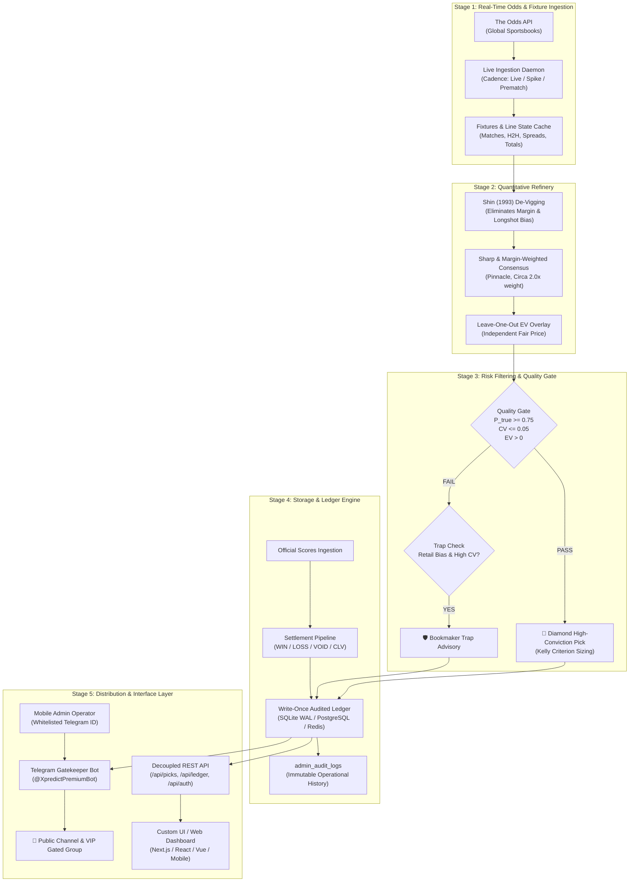

# LISA — Quantitative Sports Prediction Refinery & Autonomous Engine

> **Enterprise-grade algorithmic sports forecasting, consensus de-vigging, and execution routing with an autonomous Telegram Gatekeeper and Mobile Admin Console.**

[](https://www.python.org/downloads/)
[]()
[]()
[]()

---

## 1. Executive Summary

**LISA** (*Live Ingestion, Statistical Arbitrage & Algorithmic Refinery*) is an institutional-grade sports prediction backend. Rather than relying on black-box heuristics or subjective handicapping, LISA functions as a **mathematical data refinery**:

1. **Multi-Book Ingestion**: Ingests real-time odds across global bookmakers (Pinnacle, Bet365, DraftKings, BetMGM, etc.).
2. **Consensus De-Vigging**: Eliminates synthetic bookmaker margins and favourite–longshot bias using **Shin's Method** ($z$-parameter solving) combined with sharp/margin-weighted aggregation.
3. **Leave-One-Out Expected Value (EV)**: Measures each sportsbook's price against an independent consensus excluding itself to identify genuine market mispricings.
4. **Algorithmic Quality Gate**: Emits only high-conviction selections clearing certainty ($\ge 75\%$), strict cross-bookmaker agreement, and positive EV thresholds.
5. **Trap Detection Engine**: Automatically flags and warns against deceptive public favorites driven by retail inflation.
6. **Multi-Platform Execution Slips**: Converts selections into direct 1-click booking codes across major sportsbooks (SportyBet, Football.com, 1xBet, Bet9ja, Betway, Bet365).
7. **Write-Once Audited Ledger**: Immutable settlement pipeline grading results against official score feeds, tracking Closing Line Value (CLV) and Brier calibration.
8. **Decoupled Architecture**: 100% headless backend exposing robust REST API contracts for custom UI/UX applications, paired with an asynchronous Telegram Gatekeeper Bot and Mobile Admin Console.

---

## 2. System Architecture



---

## 3. UI Designer & Frontend Integration Guide

> [!IMPORTANT]
> **To UI/UX Designers and Frontend Engineers:**
> The LISA engine is designed to be **completely headless and UI-agnostic**. You have 100% freedom to create modern web dashboards, mobile applications, or portal interfaces using your preferred tech stack (e.g. Next.js, React, Tailwind CSS, Svelte, Vue, or Flutter). The backend provides clean REST API endpoints returning predictable, structured JSON contracts.

### Key Frontend Data Endpoints

The LISA server runs by default on `http://localhost:8080` and provides the following core endpoints:

| Endpoint | Method | Purpose | Response Format |
| :--- | :---: | :--- | :--- |
| `/api/health` | `GET` | System health, database driver, active fixtures count, bot status | JSON (`status`, `ledger_counts`, `telegram_bot`, `odds_feed`) |
| `/api/picks` or `/data/dashboard.json` | `GET` | Active refined picks, fair odds, execution recommendations, booking codes | JSON Array of Pick Objects |
| `/api/ledger` | `GET` | Audited historical settlement ledger, win rates, net units, CLV, Brier calibration | JSON (`summary`, `picks_settled`, `monthly_breakdown`) |
| `/api/forecast` | `GET` | Daily match forecast board — 10+ fixtures with consensus/model probabilities, micro pack (BTTS/O-U/scorelines), uncertainty flags, popular games | JSON (`day`, `count`, `matches[]`, `disclaimer`) |
| `/api/tiers` | `GET` | Subscription value ladder — feature matrix, per-tier reveal timing, upgrade hints | JSON (`tiers`, `features[]`, `ladder`) |
| `/data/live_booking_codes.json` | `GET` | Configurable platform-specific booking codes for accumulator / straight slips | JSON Object (`sportybet`, `football_com`, `1xbet`, etc.) |
| `/api/verify-status?user_id={id}` | `GET` | Checks if a web visitor has verified their Telegram channel membership | JSON (`verified`: `bool`, `tier`: `str`) |
| `/api/auth/me` | `GET` | Current authenticated user profile, bankroll parameters, and tier level | JSON (`user_id`, `email`, `tier`, `bankroll`) |
| `/api/auth/login` | `POST` | User authentication returning session token | JSON (`token`, `user`) |
| `/api/auth/register` | `POST` | New user account creation | JSON (`token`, `user`) |

### JSON Data Contract: Refined Pick Object

When rendering active match cards, the frontend receives picks in the following schema:

```json
{
  "id": "match_epl_20260921_mci_ips",
  "match_id": "soccer_epl_mci_ips",
  "home_team": "Manchester City",
  "away_team": "Ipswich Town",
  "sport_key": "soccer_epl",
  "sport_title": "Premier League",
  "commence_time": "2026-09-21T19:00:00Z",
  "countdown_seconds": 5400,
  "human_countdown": "Starts in 1h 30m",
  "market": "h2h",
  "outcome_name": "Manchester City",
  "p_true": 0.833,
  "fair_odds": 1.20,
  "best_odds": 1.25,
  "best_bookmaker": "SportyBet",
  "ev_pct": 4.1,
  "conviction_score": 8.4,
  "recommended_stake_units": 1.5,
  "recommended_stake_cash": 75.00,
  "is_gated": false,
  "booking_codes": {
    "sportybet": "SB-892104",
    "football_com": "FC-119284",
    "1xbet": "1X-559281",
    "bet9ja": "B9-90214",
    "betway": "BW-44912",
    "bet365": "365-88210"
  },
  "deep_links": {
    "sportybet": "https://www.sportybet.com/?code=SB-892104",
    "football_com": "https://www.football.com/?code=FC-119284",
    "1xbet": "https://1xbet.com/?code=1X-559281"
  }
}
```

### UI Implementation Guidelines

1. **Dynamic Kickoff Timers**:
   - Use the `commence_time` ISO-8601 string to initialize an active client-side ticker (`setInterval` tick every 60s) rather than displaying static countdowns.
2. **Platform Bet Codes & Logos**:
   - Rather than forcing users onto external affiliate links that get blocked by ad-blockers or telecommunications providers, display **1-Click Copyable Booking Codes** with bookmaker logos (SportyBet, Football.com, 1xBet, Bet9ja, Betway, Bet365).
3. **Gated Tier Blur**:
   - Free users see Pick #1 clear. Picks #2 and #3 are blurred until unlocked via Telegram community verification (`/api/verify-status`). Picks #4+ are unlocked for Tier 2/3 subscribers.
4. **Interactive Kelly Sizing**:
   - Multiply `recommended_stake_units` by the user's active bankroll capital configured in their profile.

---

## 4. Multi-Bookmaker Booking Code System

A major failure point in commercial sports advisory platforms is user drop-off caused by broken tracking links, domain blocks, and browser extensions.

LISA solves this by providing **Native Multi-Bookmaker Booking Codes**:

* **Supported Platforms**: SportyBet, Football.com, 1xBet, Bet9ja, Betway, Bet365.
* **Instant Slip Loading**: Bettors simply copy a 6-digit booking code (e.g. `FC-902143`), paste it into their sportsbook app, and their wager slip is automatically populated with the exact selections and market prices.
* **Administrator Overrides**: Administrators can update live accumulator codes in real time via [`web/data/live_booking_codes.json`](web/data/live_booking_codes.json) or through the Telegram Bot console without restarting the server.

---

## 5. Telegram Gatekeeper Bot & Mobile Admin Console

LISA features an integrated, asynchronous Telegram engine (`engine/lisa/telegram_bot.py`) operating under `@XpredictPremiumBot`.

### User Facing Features
* **Persistent Bottom Keyboards**: Instant 1-tap navigation for `📊 Active Top Picks`, `🏦 My Bankroll`, `📈 Accuracy Ledger`, `⚡ 5-Fold Parlay`, `🎟️ Bookmaker Codes`, and `🛡️ Trap Advisories`.
* **Stateful Bankroll Onboarding (FSM)**: A conversational Finite State Machine guides users through entering their bankroll size, selecting their Kelly risk profile (Quarter, Half, Full Kelly), and choosing their primary bookmaker.
* **Community Gatekeeper**: Automatically verifies that web visitors have joined the official Telegram community channel via `getChatMember` before unlocking free picks.

### Executive Mobile Admin Console
Instead of requiring an admin web panel with security overhead, the system owner's mobile Telegram app serves as the **Executive Control Terminal**.

Whitelisted Telegram IDs (`ADMIN_TELEGRAM_IDS=8720543490`) unlock executive commands:

| Admin Command | Syntax | Operational Function |
| :--- | :--- | :--- |
| **Console Dashboard** | `/admin` or `/sys_status` | View system run-state, active picks count, ledger health, and trigger quick-action buttons (`⏸️ Pause`, `▶️ Resume`, `🔄 Refresh`, `📜 Logs`). |
| **Manual Match Settle** | `/settle <match_id> <WIN\|LOSS\|VOID>` | Atomically settles bugged, delayed, or postponed matches; recalculates net units and CLV; syncs public ledger; notifies VIP channels. |
| **Customer Provisioner** | `/grant <email> <tier1\|tier2\|tier3>` | Grants manual access (cash/crypto payments or influencer trials), updates user profile to active, and generates a self-destructing 1-use channel invite link. |
| **Global Broadcast** | `/broadcast <message>` | Securely transmits high-priority announcements across both public community and VIP channels simultaneously. |
| **Emergency Kill-Switch** | `/sys_pause` | Immediately halts all automated channel broadcasts if a data provider feed fails or provides corrupted odds. |
| **System Resume** | `/sys_resume` | Restores automated signal generation and broadcast distribution. |
| **Audit Log Trail** | `/admin_logs` | Dumps recent immutable administrative records from `admin_audit_logs`. |

---

## 6. Mathematical Core & Methodology

### 1. Shin's Method De-Vigging
Traditional de-vigging proportionally divides the overround across outcomes, preserving the favourite–longshot bias. LISA solves for Shin’s insider-trading parameter $z$ such that:

$$\sum_{i=1}^n \left( \sqrt{z^2 + 4(1-z)\frac{p_i^2}{\pi_i}} - z \right) \Big/ 2(1-z) = 1$$

This extracts the true objective win probability $P_{\text{true}}$ free of sportsbook distortion.

### 2. Leave-One-Out Expected Value
Rather than testing an odds offering against a consensus that includes that very bookmaker's price, LISA calculates consensus excluding bookmaker $b$:

$$\text{EV}_b = \left( P_{\text{true}, \setminus b} \times \text{Odds}_b \right) - 1$$

A selection is only emitted if $\text{EV}_b > 0$.

### 3. Trap Detection Engine
When a high-profile public favorite exhibits:
* Extreme retail handle concentration
* High cross-bookmaker coefficient of variation ($\text{CV} > 0.05$)
* Negative Leave-One-Out EV across sharp books (Pinnacle/Circa)

LISA suppresses the selection and emits a **Trap Advisory**, preventing users from falling into value-negative chalk traps.

---

## 7. Configuration & Environment Variables

Copy `.env.example` to `.env` and configure your credentials:

```bash
cp .env.example .env
```

```ini
# ==============================================================================
# TELEGRAM BOT & CHANNEL DISPATCH
# ==============================================================================
LISA_TELEGRAM_TOKEN=
LISA_TELEGRAM_CHAT_ID=
LISA_TIER2_TELEGRAM_CHAT_ID=
ADMIN_TELEGRAM_IDS=

# ==============================================================================
# DATA SOURCE: THE ODDS API
# ==============================================================================
THE_ODDS_API_KEY=your_the_odds_api_key_here
THE_ODDS_API_BASE_URL=https://api.the-odds-api.com

# ==============================================================================
# REFINERY & QUALITY GATE PARAMETERS
# ==============================================================================
LISA_GATE_THRESHOLD=0.75
LISA_MAX_CV=0.05
LISA_MIN_BOOKS_ALERT=5
LISA_STORAGE=sqlite
LISA_PORT=8080
```

---

## 8. Quickstart & Operational Commands

### 1. Launch Unified Production Stack
Runs the HTTP REST API server, live Odds API background poller, and Telegram Bot Gatekeeper daemon concurrently:

```bash
PYTHONPATH=engine python3 -m lisa.cli start --port 8080
```

### 2. Run Telegram Bot in Interactive Terminal Console
Test user interactions and administrative commands directly from your shell:

```bash
PYTHONPATH=engine python3 -m lisa.cli telegram-bot --interactive
```

### 3. Run Automated Tests
Execute the 262 unit and integration tests covering the mathematical core, FSM, admin overrides, REST endpoints, and the real-archive audit canaries:

```bash
PYTHONPATH=engine pytest engine/tests
```

### 4. Docker Deployment
Deploy via Docker Compose with zero external dependencies:

```bash
docker compose up -d --build
```

---

## 8. Honest Historical Evaluation

LISA's audit tooling was rebuilt on a **real, sourced, reproducible archive** — no synthetic fixtures are used anywhere in the backtest.

### Data

* **Source**: [football-data.co.uk](https://www.football-data.co.uk) — real early pre-match odds (bet365, Bet&Win, Pinnacle, William Hill, VC Bet) **plus each book's closing (`*C`) snapshot**, paired with the official final scorelines.
* **Coverage**: 5 top-flight leagues × seasons 2021/22–2024/25 — EPL `soccer_epl`, La Liga `soccer_spain_la_liga`, Bundesliga `soccer_germany_bundesliga`, Serie A `soccer_italy_serie_a`, Ligue 1 `soccer_france_ligue_one`. **7,155 completed matches**.
* **Packaged under** `engine/lisa/historical/` (see `NOTICE` for attribution). *NBA was removed from the historical layer* (football-data.co.uk publishes soccer-only archive lines).

### `lisa backtest`

Grades the real archive through the production refinery (Shin de-vigging → consensus → certainty gate → Fractional Kelly) and reports honest institutional metrics:

```bash
PYTHONPATH=engine python3 -m lisa.cli backtest --json --export-json /tmp/bt.json
```

Every report carries a `data_provenance` block stating exactly what it ran on, and **Grade B "smart pivots" were removed** because that market type cannot be honestly priced from a 1X2-only archive. The per-strategy profiles (Conservative, market-favourite baseline, always-home baseline, Derived 2-Leg Parlays, Derived 70/30 Blend) are all computed from real recorded outcomes; derived scenarios are explicitly labelled "derived".

**CLV is now measured against the real closing line.** The archive ships *two* snapshots per match: the executed early line (the five books' pre-match prices) and the true closing line (each book's `*C` late price). `positive_clv_rate` is no longer trivially 1.0 — it is the honest fraction of bets whose executed price beat the later closing price (**37.9%**, mean CLV **−1.1%**): the early snapshot did not beat the close on average.

**Real data only**: every prediction result and scoreline in the ledger is bound to the packaged archive's official final score and re-graded against it in tests (`test_backtest_validation_binds_to_archived_scores`, `test_every_bet_result_validated_against_archived_outcome`). The live demo generator (`fixtures_generator.py`) is quarantined behind `--fixtures`, self-labels its payloads `synthetic/demo`, and is never fed into the audit engines. `lisa backtest --export-json` streams the full 7k-record ledger in cleared batches to keep peak memory bounded.

### `lisa tune`

A threshold × league sweep over the real archive — the profitability experiment. Every cell is graded against official archived results, the best configs are re-checked **per season** (guards against tuning on one lucky window), and a risk-controlled Kelly simulation applies fractional Kelly (50%, 5% per-bet cap, 25% drawdown stop):

```bash
PYTHONPATH=engine python3 -m lisa.cli tune --export-json /tmp/tune.json
PYTHONPATH=engine python3 -m lisa.cli tune --thresholds 0.75,0.80 --leagues soccer_epl --json
```

**Verdict (honest): no config is robustly profitable on this archive.** Full-sample ROI is negative for most settings (e.g. 0.75/ALL: −1.7%); the handful of positive cells (e.g. 0.80/EPL +5.5%, n=75) each have at least one **losing season** (EPL 0.80's 2022/23 was −8.0%) and *every cell loses to the closing line* (negative CLV across the board). The Kelly simulation stakes ≈0 for the recommended config because the model's `p_true` on these favourites implies positive-fraction-of-Kelly ≈ 0 — prices sit at or above fair. Treat the positive cells strictly as hypotheses to re-validate on fresh matches; do not ship a "profitable" claim from this archive.

### `lisa study`

The market-efficiency study across **every market the archive ships**: 1X2, Asian Handicap, and Over/Under 2.5 — each with real early *and* closing snapshots and a close/early movement ratio per outcome. It answers *"is there ANY exploitable pattern in the markets we can price?"* using only archived prices and official scores:

```bash
PYTHONPATH=engine python3 -m lisa.cli study --export-json /tmp/study.json
```

* Bins early implied probability against the **real** outcome frequency per market (a market-calibration curve).
* Chases the early favourite and measures true late-to-close CLV, broken down by **movement direction** (closing/early price ratio: `steam_in` < 0.97, `slight_in`, `slight_out`, `drift_out` > 1.03).
* Reports score-derived analytics — BTTS frequency (54.7% overall), most-common correct scores — plus an **independent no-look-ahead Poisson model BTTS calibration** (no odds used).

**The honest headline finding: the closing line is more efficient than the early line.** Early favourites that *shortened* toward the close (`steam_in`) cover at materially higher rates than those that drifted out — e.g. 1X2 steam-in favourites win 55.1% with **+6.6% CLV** vs 48.9% / **−7.3%** for drift-out. Because the final move is unknowable in advance, this is *not* directly bankable from the archive — but it is precisely the mechanism a **real-time early-bird line-movement system** (poll odds from kick-off minus N hours, enter as steam builds, before the close) would try to capture. That is the only literature-backed route to edge identified so far, and it requires the live odds tier, not the archive.

### `lisa forecast`

The **daily match forecast board** — the honest volume product that pairs with the rare staked picks. It separates *forecasts* (a probability for every fixture — 10+ a day by design) from *staked bets* (only the tiny subset that clears a real certainty gate). The board is served from the real packaged archive in offline/demo mode (`mode: archive`); in production the identical schema streams from live odds.

```bash
PYTHONPATH=engine python3 -m lisa.cli forecast            # full board
PYTHONPATH=engine python3 -m lisa.cli forecast --top      # popular + pick of the day only
PYTHONPATH=engine python3 -m lisa export-forecast         # writes web/data/forecast.json + tiers.json
```

Per fixture: **market consensus 1X2** (Shin de-vig across the day's books), **independent model probabilities** (no look-ahead), a **micro pack** (BTTS %, over/under 2.5 %, expected goals, most-likely scorelines), steam/movement direction, and an **uncertainty flag** (`low` / `medium` / `high`) with plain-English reasons — market disagreement (high CV), model-vs-market disagreement, thin book coverage, short model history, or a heavy favourite where the model and market diverge (a classic sucker spot). **High-uncertainty fixtures are labeled "do not stake"** — the board is a forecast, not a betting tip. The most-covered fixtures are surfaced as `❤ POPULAR` (marquee), and the day's single strongest *genuine* consensus is `★ Pick of the Day` — which is omitted entirely when nothing clears the honesty bar.

The web dashboard renders this board live (Forecast Board tab), with per-tier lock teasers on the micro pack / Pick of the Day / diamond picks / steam radar.

### `lisa tiers`

The production **subscription value ladder** — the single source of truth the pricing page, `/api/tiers`, the web comparison matrix and any dispatch gating all read from:

```bash
PYTHONPATH=engine python3 -m lisa.cli tiers[--json]
```

Four tiers (`free`, `tier1`, `tier2`, `tier3`) map to 14 features with explicit **reveal timing** (how many minutes before kickoff each tier receives a signal: the higher the tier, the earlier). The honest ladder: every upgrade buys *earliness + breadth + depth* — never a promised win. Tier 3 owns the earliness/speed layer (earliest reveals, API + webhook feed, portfolio risk, soft-book stream, weekly audit PDF).

### `lisa walkforward`

A strictly chronological evaluation comparing LISA's market-gated consensus to an **independent Elo + Poisson model** that has never seen any odds:

```bash
PYTHONPATH=engine python3 -m lisa.cli walkforward --json --export-json /tmp/wf.json
```

* No look-ahead: each match is predicted from state that existed strictly *before* it, then state is updated.
* Reports calibration (Brier, LogLoss, ECE, Wilson CI) plus head-to-head ROI at both "best recorded price" and "mean of five books" (the realistic price a bettor receives).

### Reference results (as shipped)

| Strategy | Bets | Win % | ROI @ best price | ROI @ avg price |
|---|---|---|---|---|
| Gated 🛡️ Conservative Singles (`backtest`) | 380 | 79.7% | −1.8% | — |
| Market Favourites baseline (`walkforward`) | 7,155 | 53.9% | −0.8% | −2.8% |
| Independent Elo/Poisson model value | 4,910 | 40.5% | −6.5% | −8.9% |

The honest headline: the archive spans a market-efficient period — a quality-gated 79.7% win-rate book still produced **negative ROI at closing prices**, and neither baseline nor an independent model beat the market. Calibration metrics are reported openly (Brier, ECE, reliability curve) rather than curated.

### Un-gameable test suite

`engine/tests/` includes integrity canaries that make it impossible to silently reintroduce synthetic data: no future-dated or NBA fixtures, a real closing snapshot on **every** archived match, **three real markets per match** (1X2, Asian Handicap, O/U 2.5) with self-consistent close/early movement, real provenance on every export, exact archive fingerprints, walk-forward determinism, no-look-ahead model tests, AH grading unit tests (quarter/half/whole balls, pushes), a tuning-parity test asserting `lisa tune`'s 0.75/all-leagues cell reproduces the backtest's executed ledger exactly, forecast-board determinism + volume guarantees (8+ fixtures/day, honest disclaimer), and tier-entitlement canaries (monotonic unlocks, reveal timing never later for a higher tier, and a 4-tier upgrade ladder that adds value at every step).

---

## 9. Repository Layout

```
├── .env.example               # Environment variables template
├── README.md                  # Project overview & architectural guide
├── architecture/              # Original product architecture blueprints
├── docs/
│   └── DESIGN.md              # Mathematical proofs, Shin analysis, and benchmark reports
├── engine/                    # Python core package (stdlib-only runtime)
│   ├── lisa/
│   │   ├── shin.py            # Shin (1993) de-vigging & z-parameter root finder
│   │   ├── consensus.py       # Sharp/margin-weighted consensus aggregation
│   │   ├── gate.py            # 75% Certainty gate, Leave-One-Out EV, and Trap detector
│   │   ├── history.py         # Real historical archive loader (football-data.co.uk)
│   │   ├── markets.py         # AH / O/U grading (quarter balls) + BTTS/correct-score analytics
│   │   ├── study.py           # Multi-market efficiency + steam/movement study engine
│   │   ├── bulletin.py        # Daily match forecast board (10+/day, uncertainty flags, popular games)
│   │   ├── tiers.py           # Subscription value ladder: feature matrix, reveal timing, upgrades
│   │   ├── historical/        # Packaged real CSVs + NOTICE attribution
│   │   ├── model.py           # Independent Elo + Poisson 1X2 model (no-look-ahead)
│   │   ├── walkforward.py     # Chronological walk-forward evaluation engine
│   │   ├── backtest.py        # Honest archive backtest + calibration + provenance
│   │   ├── tuning.py          # Threshold×league sweep, per-season splits, Kelly risk sim
│   │   ├── storage.py         # SQLite WAL, Postgres, and Redis storage drivers
│   │   ├── telegram_bot.py    # Telegram Bot, FSM bankroll onboarding & Admin console
│   │   ├── live_ingest.py     # Background odds poller & alert dispatcher
│   │   ├── server.py          # Decoupled HTTP/REST API server
│   │   ├── settle.py          # Automated match settlement & CLV calculator
│   │   └── cli.py             # Unified CLI commands (start, telegram-bot, backtest, walkforward, tune, study, forecast, tiers, export-forecast)
│   └── tests/                 # 262 comprehensive automated unit and integration tests
├── web/                       # Reference decoupled web terminal
│   ├── index.html             # UI structure & layout
│   ├── css/                   # Vanilla styling & responsive glassmorphic system
│   ├── js/                    # Client app, REST API bridge, countdowns & calculator
│   └── data/                  # Static fallbacks & live_booking_codes.json
└── docker-compose.yml         # Containerized production deployment
```

---

## 10. Security & Responsible Gambling

* **Anti-Piracy Content Protection**: Telegram broadcasts utilize `protect_content=True` to prevent forwarding, saving, or leaking proprietary signals outside authorized channels.
* **Single-Use Self-Destructing Links**: Subscriber channel invitations are cryptographically generated with `member_limit=1` and a 5-minute time-to-live.
* **Responsible Bankroll Guidance**: All alerts enforce strict Kelly Criterion stake sizing (never exceeding 2.0–3.0% of active capital) to ensure long-term risk preservation.
