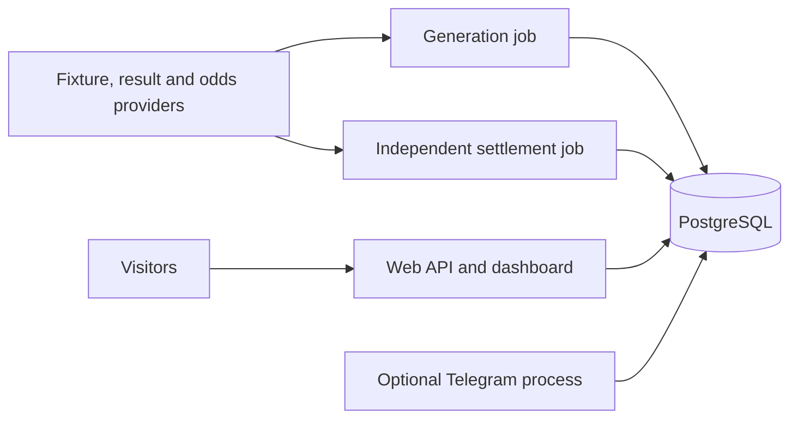

# PostgreSQL architecture for pre-production

Decision: PostgreSQL 18 is the primary application database. Use a modular Python
application with separate web and worker processes, rather than separate services
with duplicated databases. SQLite remains an explicit offline/test backend.



## Implemented boundaries

- PostgreSQL stores authentication, sessions, the prediction ledger, final scores,
  publication snapshots, telemetry, verification records, bankroll profiles,
  notification outbox, and worker leases. Web and workers share those repositories.
- Each operation borrows its own connection from a bounded pool (maximum 10 per
  process). Pool checkout, connection establishment, statements, and locks have
  timeouts. Exceptions roll back before returning a connection to the pool.
- Shared business queries use bound values and portable SQL. Backend-specific
  schema, parameter syntax, locking, connections, and database inspection are
  explicit. PostgreSQL never inherits SQLite connection/file behavior.
- Versioned migrations 1–6 run transactionally under a PostgreSQL advisory lock;
  migration 5 adds recorded paper-pilot job cycles.
  An unversioned legacy PostgreSQL database or newer unknown schema fails startup
  rather than receiving an unsafe guessed migration. This project has no live
  production data; start with a fresh PostgreSQL database.
- Generation and settlement have independent leases. Lease acquisition uses an
  atomic conditional update; publication locks the generation lease row and checks
  ownership before atomically inserting forecasts and replacing the board snapshot.
  Provider network requests and model fitting occur outside write transactions.
- Generation preserves first-publication probabilities/prices and line identity.
  Settlement has its own thread and provider cache and does not require the model
  or the odds feed. Final results can still be delayed by provider cache/freshness.
- An admin refresh request is persisted, so the web process can signal a separate
  worker. Workers check it within five seconds of their next polling wait; it does
  not interrupt an already-running provider cycle. Runtime overrides are reloaded
  by the worker, and readiness checks both jobs in separate-worker mode.
- Redis is not required. Saved boards and small operational snapshots fit the
  relational database. Introduce a shared cache only after measuring a bottleneck.

Publication payloads remain JSON text and prediction timestamps remain canonical
UTC ISO text for compatibility with existing Python repositories. The indexed
ledger is relational. Typed timestamp/JSONB conversions would require a distinct
migration and corresponding repository changes; they are not silently assumed.

## Run the stack

A private local `.env` was created with independent, URL-safe PostgreSQL admin and
application passwords. No data-provider credentials were created. Existing local
SQLite files are retained; they are not imported as production history.

```sh
docker compose config --quiet
docker compose up --build -d db web worker
curl --fail http://127.0.0.1:8080/api/ready
```

The stack builds PostgreSQL dependencies and the Python timezone-data fallback
into the image, so Africa/Lagos works even on minimal OS images. The database has
no published host port; web binds only to localhost. PostgreSQL 18 data uses the
`/var/lib/postgresql` volume, matching the
[official image](https://hub.docker.com/_/postgres). A non-superuser application
role owns the application database; admin credentials are confined to the DB
service. The initialization script runs only against a new database volume.
Do not delete the database volume to restart/rebuild the application.

Configure FOOTBALL_DATA_TOKEN and SHARPAPI_KEY in `.env` for broader calendars
and priced opportunities. No-provider or provider-failure operation reports
unready; an HTTP-successful liveness endpoint is not proof of daily predictions.
Add TLS/reverse proxy and off-host backups before exposing a production service.

The optional Telegram profile runs one bot process (no provider ingestion):

```sh
docker compose --profile telegram up -d telegram
```

It requires real Telegram configuration. Its temporary conversation state and
payment-key store remain process-local; verified paid checkout remains disabled.
Do not scale bot polling to multiple replicas or promise restart-persistent billing.

## Backups and verification

For PostgreSQL, use pg_dump custom-format snapshots and test pg_restore on a fresh
isolated database. Example:

```sh
docker compose exec -T db pg_dump -U postgres -d lisa -Fc > lisa-backup.dump
```

The dump contains user data and requires private file permissions and off-host
storage. Prefer a managed PostgreSQL service with tested point-in-time recovery
when moving to production. The SQLite backup script applies only to SQLite.

[Pool behavior](https://www.psycopg.org/psycopg3/docs/advanced/pool.html) and
[PostgreSQL locking](https://www.postgresql.org/docs/current/explicit-locking.html)
were checked against official documentation.

Local checks: lifecycle/architecture tests, frontend checks, compile checks, and
Compose configuration validation. Actual PostgreSQL startup/integration and the
full pytest suite cannot run here because package downloads and Docker daemon
access are restricted. Six real PostgreSQL integration tests are provided, and
CI provisions PostgreSQL 18 and runs the complete pytest suite. CI is configured,
not claimed to have run. Run integration tests only with LISA_TEST_POSTGRES_URL
pointing to a disposable database whose name ends in `_test`.

Systemd templates also use PostgreSQL and separate web/worker units. Adjust their
user and installation paths and provide a reachable PostgreSQL URL in the host
`.env`; the Compose-only internal hostname `db` is not a host-run connection URL.
The Compose deployment is the default pre-production setup.
