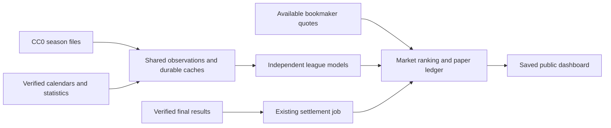

# Data sources with distinct responsibilities

Implemented 2026-10-04. The runtime retains the existing web application,
generation job, settlement job, history job and shared database. No new service,
database, dependency or manual upload directory was added. Provider adapters
remain interchangeable; they are assigned work according to the useful data
they supply.

## Source choices

| Input | Primary contribution | Collection policy |
|---|---|---|
| Openfootball CC0 JSON | Historical full-time goals, available half-time scores, provisional schedules | No key; durable daily current-season files, monthly completed-season files; no settlement calls |
| OpenLigaDB | Timed fixtures and results for its supported German leagues | First verified calendar route for those leagues |
| Football-data.org | Current timed fixtures and final results for entitled competitions | Primary outside OpenLigaDB coverage; historical goals are fallback when bulk history is unavailable |
| AllSports | Supporting fixtures/results, statistics, player observations and available half-time scores | Calendar fallback; resumable historical windows preserve supporting statistics |
| API-Football | Statistics, including actual corner counts where entitled and available | Calendar/history fallback plus bounded statistics enrichment; separate settlement reserve retained |
| The Odds API / direct OddsPapi | Current bookmaker offers, market lines and quote timestamps | Existing shared quota ledgers, caches and account limits remain authoritative |
| TheSportsDB | Additional calendar discovery | Opt-in; its clipped free responses do not justify querying it by default |
| SharpAPI | Optional supported bookmaker prices | Constructed only when a key is configured; it does not block other price sources |

The Openfootball adapter supports Premier League, Championship, Bundesliga,
La Liga, Serie A, Ligue 1, Eredivisie and Primeira Liga. These are **bulk input
leagues**, not a claim that every league has a verified upcoming calendar or
executable odds. Entitlements, actual file coverage and price joins still need
measurement on the running deployment.

Oritzio's inspected file is a team directory, not a schedule. FixtureDownload,
Football-Data.co.uk and KickoffClock were not enabled as automatic production
feeds: their inspected contents or reuse terms do not establish the required
public-product data contract. Existing local CSV research/import tools remain
available; they are not a newly approved production source. See the publisher
links and limitations in [FILE_SOURCE_ASSESSMENT.md](FILE_SOURCE_ASSESSMENT.md).

## One pipeline



For each league, collection requests one verified calendar source. Another
source is queried only if the earlier route fails or returns no fixtures.
Providers on separate hosts remain concurrent; calls within a provider remain
serial. Bulk history runs alongside calendar collection and never satisfies the
verified calendar slot. In the routing regression, three healthy overlapping
calendar sources require one call rather than three. Fallbacks consume their
normal provider budget when actually needed.

The existing admin coverage view exposes these routes and distinguishes primary
from fallback league assignments. Quota envelopes are conservative bounds;
they are not authenticated account entitlements or promises of price freshness.

## Correctness and resource bounds

The bulk adapter downloads only eight allowlisted league filenames under the
publisher's fixed GitHub host. It validates document size, season and league,
score shapes, teams, duplicate identities, dates and available half-time scores.
Downloads and decompression are bounded. Invalid JSON is not cached. Persistent
snapshots retain payloads, hashes, retrieval times and conditional HTTP
validators in the existing database. Vercel does not depend on a local download
directory. An HTTP 304 renews the cache; a failed season has a persistent
24-hour retry cooldown and does not erase another usable season.

Generation bootstraps the current and previous season, at most two cold file
downloads per supported league. The history job collects up to four recent
seasons through existing bounded checkpoints. Current files default to a
24-hour cache; completed files refresh monthly. After a restart, fresh database
caches require no network download. Retrieval freshness does not establish that
the publisher's underlying match data has changed.

The publisher does not specify UTC offsets in the inspected file records.
Every file date is therefore an explicitly unknown-time storage anchor. Those
rows cannot become upcoming selections, appear as invented midnight kickoffs
on the public board, or settle a saved prediction. Date-only results enter
training no earlier than 12:00 UTC on the following day; this conservative
availability assumption is not a historical publication timestamp.

One shared team identity rule now connects history, production goal models,
duplicate detection and settlement fallback. Display names remain unchanged.
An archive row joins a timed observation only for one unambiguous pairing on
the league's local date. Verified observations take priority; conflicting final
scores are withheld from training. Discovery files have no authority to delay
settlement of an otherwise confirmed result. Ambiguous same-day rematches are
not guessed. Model version `league-dixon-coles-v3` invalidates old fit/evidence
caches; saved predictions from earlier versions remain eligible for settlement.

Statistics checkpoints retain successfully collected fixture IDs even if the
next request fails. Useful bulk goals remain available when metered enrichment
is inaccessible. Missing corners, player observations or first-half values
remain missing.

## Markets and earning opportunity

More eligible goal history supports the existing 1X2, double chance, draw no
bet, goal totals, team goal totals, BTTS, correct-score and offered Asian-line
calculations. Existing corner totals still require actual corner history; the
bulk files do not provide it. Available half-time scores are preserved for
future separately validated first-half models.

Cross-match accumulator candidates now apply their minimum winning probability
**after** the correlation adjustment. They remain research combinations:
multiplying individual odds does not verify a bookmaker's combined offer.
Executable same-game accumulators require actual joint quotes and dependence
modelling. Player props, cards, team corner handicaps and minute-by-minute live
bets still lack validated models and sufficient entitled live inputs.

Winning probability and earning opportunity remain separate. Ranking value
requires the price of the exact selection, line, period and payout contract;
unpriced forecasts have no measured EV. Accumulating legs raises potential
payout while reducing the chance of winning the full ticket. Nothing in this
integration establishes profitability. Paper mode continues to recommend zero
stake.

## Configuration and verification

```dotenv
LISA_ENABLE_OPENFOOTBALL=true
LISA_OPENFOOTBALL_CACHE_SEC=86400
LISA_ENABLE_SPORTSDB=false
```

Openfootball needs no new key. Its cache setting accepts six hours through seven
days and is editable through the existing runtime settings. Environment/admin
overrides take precedence over defaults. The private credential fields were
preserved. Restart existing local processes after this code update:
`python3 scripts/local_paper.py`. Inspect **Production testing** and coverage in
the admin console, and use `--diagnose` for a credential-safe database check.

Verification included 24 new integration/regression checks for parsing, durable
caching, failed seasons, routing, identity, publication, settlement and
accumulator thresholds. The stdlib release suite ran 196 tests: 187 passed and
nine PostgreSQL integration checks were skipped without a test database. All
four JavaScript test files and the Vercel public-asset build passed. The full
pytest suite could not run because pytest installation is unavailable through
this workspace's restricted package access.
The credential-safe check summary is saved in
[free-stack-validation.json](free-stack-validation.json).

The current model was also reevaluated on 7,156 existing archive observations
across five leagues with chronological holdouts. Its aggregate scores match
the previous version on those already consistent team names; the identity fix
is not evidence of improved predictive skill. Results are in
[model-evaluation-v3.json](model-evaluation-v3.json), with staking approval
explicitly false. Archive quote times and subsequent corrections are unknown.

Publisher samples and licences were inspected through browser access. Direct
application downloads remain blocked in this coding workspace, so live bulk
collection, all-season completeness, provider join rates, resource consumption
on Vercel and actual settlement latency still need validation on the user's
network-enabled local host or deployed testing environment. The implementation
does not certify those external conditions.
