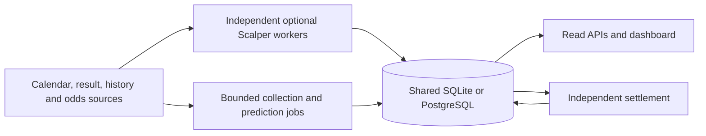

# System architecture

xPredict is a modular Python application with one shared publication/settlement
ledger. The dashboard and operator console read saved state. Data collection,
model generation and result settlement have separate responsibilities.

## Hosting

| Deployment | HTTP/static serving | Background work | Storage |
| --- | --- | --- | --- |
| Vercel production testing | Static CDN assets plus `api/index.py` | Authenticated finite history/generation/settlement functions | Supabase transaction-pooler PostgreSQL, `lisa_private` schema |
| Native/Docker | Python HTTP process and `web/` assets | Supervised worker processes or local launcher | PostgreSQL; SQLite for explicit local/offline use |
| Scalper | Native provider bridge reads stored records | Independent core and optional browser collectors | Same database and schema as the consuming app |

Vercel uses the single-function configuration in `vercel.json`. An engine library
is not a separate HTTP service. Persistent browser loops need a worker host.
The Vercel adapter enforces paper mode, PostgreSQL and encrypted database-backed
provider overrides. Native PostgreSQL uses the `public` schema unless explicitly
configured otherwise; it does not automatically share Vercel's private ledger.

## Main boundaries

- [Providers](../providers/DATA_SOURCES.md) supply observed data with source IDs,
  timestamps and explicit capabilities. An advertised endpoint is not account
  entitlement or evidence of complete coverage.
- [Scalper](../scalper/README.md) persists reusable batches and failure state.
  The prediction process can read it in supporting or sole-source mode.
- [Generation](DAILY_SERVICES.md) verifies fixtures, obtains history, fits/reuses
  league models, evaluates actual offered contracts and saves a publication.
- [Selection](../product/PICK_FEED.md) chooses one qualifying headline per match.
  The API rechecks offer expiry and applies access rules on every read.
- [Settlement](DAILY_SERVICES.md) grades original exact contracts from confirmed
  final observations, independently of price collection and model fitting.
- [Storage](DATABASE.md) owns transactions, migrations, immutable original
  observations, accounts, shared quotas and worker leases.
- [API projections](FRONTEND_API.md) serve consistent saved state to the
  dashboard, console and optional Telegram consumers.

Network calls and model fitting occur outside database write transactions.
Generation and settlement use separate durable leases. Public requests cannot
force provider traffic or create a new publication.

## Supported product and remaining gaps

The football goal distribution supports 1X2, double chance, draw no bet, goals,
team goals, BTTS, correct score and supported offered Asian contracts. The
separate corner model needs actual corner history. The public pick feed needs
current matching offers, sufficient probability and estimated value. Basic
unpriced match probabilities remain analysis.

Cards, fouls, throw-ins, player props, half-time models and low-latency live
micro-markets do not become supported predictions merely because a collector
retains some underlying fields. Cross-match accumulators are research
combinations; same-game combinations need validated dependence and a real
combined sportsbook offer.

Verified checkout, sportsbook booking codes, subscriber webhook delivery and
several legacy marketing promises are incomplete. Optional Telegram requires
its own credentials and permissions. The legacy broad sports/consensus code
is not a working multi-sport version of the current football model product.

A healthy HTTP process, a successful collector and a populated forecast board
measure different things. Check publication age, source failures, model-ready
fixtures, current priced fixtures, qualifying selections and settlement backlog.
Deployment smoke checks and model validation are separate acceptance steps.
